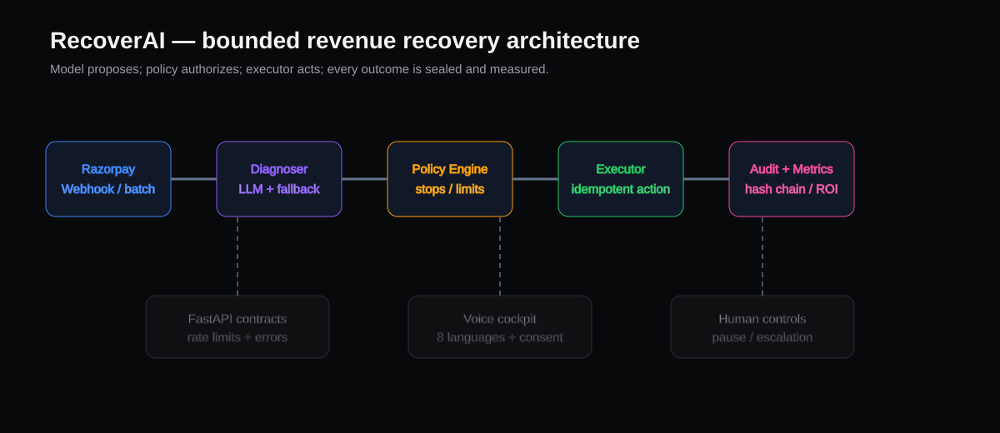

# RecoverAI

AI-powered revenue recovery for Razorpay Test Mode.

## Hackathon Track

**Track 03 — AI Revenue Recovery**

RecoverAI detects failed payments, determines a bounded recovery intervention, executes a safe recovery workflow, measures recovered revenue, and records an auditable trail.

## Repository Layout

- `RecoverAI-standalone.html` — the app UI: a single self-contained page served directly by the backend at `/`. No Node/npm, no build step.
- `backend/` — FastAPI service: API, policy engine, database, and the UI above.
- `docs/` — shared architecture and API contract.

## Safety Boundary

All financial actions are limited to Razorpay Test Mode / simulated gateway behavior. No production money movement is used for the hackathon demo. Secrets must never be committed.

## 🚀 Quick Start (one command)

Requires **Python 3.10–3.12**. Everything else (venv, dependencies, `.env`) is set up automatically on first run. There is no frontend build step — the backend serves the UI directly.

**Windows:**
```bat
git clone https://github.com/harinish45/AI-Revenue-Recovery.git
cd AI-Revenue-Recovery
start.bat
```

**macOS / Linux:**
```bash
git clone https://github.com/harinish45/AI-Revenue-Recovery.git
cd AI-Revenue-Recovery
chmod +x start.sh
./start.sh
```

The script starts the server and opens your browser:

| Service | URL |
|---|---|
| RecoverAI App | http://localhost:8000 |
| Swagger API docs | http://localhost:8000/docs |

Then in the UI: click **Seed Data → Run Batch Recovery → Arm Failure Simulation → Execute** an open case.

**Docker Compose:**

```bash
cp .env.example .env
docker-compose up --build
```

Open `http://localhost:8000` after the backend reports that it is listening.

## Architecture

```text
Failed Payment → Detect → Diagnose → Decide → Policy Gate → Recovery Action → Result → Audit → Metrics
```

The entire UI is `RecoverAI-standalone.html`, fetching directly from the FastAPI backend. FastAPI serves that file at `/` (same-origin, so no CORS setup is ever needed to use it).

## Run the Demo (manual / no script)

```powershell
cd backend
python -m venv .venv
.\.venv\Scripts\Activate.ps1
pip install -r requirements.txt
uvicorn app.main:app --reload --host 0.0.0.0 --port 8000
```

Open `http://localhost:8000`.

If the backend environment is already installed:

```powershell
cd backend
uvicorn app.main:app --reload --host 0.0.0.0 --port 8000
```

## 5-Minute Pitch Flow

1. Show **Razorpay Hackathon Sandbox | Test Mode Active | Simulated Gateway**.
2. Click **Seed Data** and show the recovery queue.
3. Point out live **At Risk**, **Recovered**, **Recovery Rate**, **Open Cases**, and **Escalated Cases**.
4. Click **Run Batch Recovery** and show the returned metrics and recovery toast.
5. Click **Arm Failure Simulation**. The control becomes red and explicitly says the next execution will escalate.
6. Execute an open case.
7. Show the escalation badge and the human-review toast.
8. Open the **Voice Agent** panel and run a Hinglish recovery call — the captured promise/dispute is written to the real audit trail.
9. Click **View Compliance Audit** and show the backend events proving diagnosis, policy gating, execution, escalation, and voice interactions.

## Verified API Contract

```text
POST /api/demo/seed
POST /api/demo/reset
GET  /api/dashboard/summary
GET  /api/cases/
POST /api/demo/recovery-batch
POST /api/demo/simulate-failure
POST /api/execution/execute
GET  /api/audit/
POST /api/cases/{case_id}/voice-events
```

Execution requests require a unique `Idempotency-Key` header. Repeating the same key returns the original result without running the recovery twice.

Execution payload:

```json
{"case_id":"<OPEN_CASE_ID>"}
```

Voice event payload (written to the real audit trail, actor `voice_agent`):

```json
{"event_type":"voice_promise_captured","intent":"PROMISE_TO_PAY","transcript":"haan bilkul pay kar dunga"}
```

`event_type` is one of `voice_call_started`, `voice_call_ended`, `voice_promise_captured`, `voice_dispute_raised`.

The deterministic failure simulation returns `status: "needs_human_review"` and is rendered by the UI as **ESCALATED TO HUMAN**.

## Environment Variables

Backend variables are read from `.env` when using Docker Compose and from `backend/.env` for a local uvicorn run. Copy `.env.example` to `.env`; the included values keep the demo in simulated gateway mode. Set `RAZORPAY_KEY_ID`/`RAZORPAY_KEY_SECRET` only if you want to exercise real Razorpay Test Mode calls.

| Variable | Description | Sample value | Required? |
|---|---|---|---|
| `RAZORPAY_KEY_ID` | Razorpay Test Mode API key ID | `rzp_test_recoverai_demo` | No — blank uses simulated gateway |
| `RAZORPAY_KEY_SECRET` | Razorpay Test Mode API key secret | `recoverai_demo_secret_not_production` | No — blank uses simulated gateway |
| `RAZORPAY_SIMULATE` | Keep gateway calls simulated for the demo | `true` | Yes for the safe demo default |
| `DATABASE_URL` | SQLAlchemy database URL (SQLite by default; no external DB needed) | `sqlite:///./recoverai.db` | No — defaults to `sqlite:///./recoverai.db` |
| `CORS_ORIGINS` | JSON list of allowed CORS origins — empty by default since the app is served same-origin at `/`; only needed if you open `RecoverAI-standalone.html` directly via `file://`, in which case set it to `["null"]` | `[]` | No — defaults to `[]` |
| `MAX_RETRIES` | Maximum automated retry attempts per recovery case | `2` | No — defaults to `2` |
| `MAX_AMOUNT` | Policy gate ceiling (in INR) above which automated recovery is blocked | `50000.0` | No — defaults to `50000.0` |
| `RATE_LIMIT_EXECUTE` | Rate limit applied to `POST /api/execution/execute` | `20/minute` | No — defaults to `20/minute` |
| `RATE_LIMIT_DEMO` | Rate limit applied to the `/api/demo/*` and voice-event endpoints | `10/minute` | No — defaults to `10/minute` |

## Development Boundary

Do not add production payment credentials or real money movement to this project.

## Why this matters

Revenue leakage is a sequence, not a single failure: a checkout is abandoned,
a payment degrades, a subscription retry fails, or an invoice goes overdue.
RecoverAI closes that loop in Test Mode: detect the risk, diagnose the cause,
choose the least-cost intervention, recover measurable money, or escalate
without crossing a policy boundary.

## What is genuinely working

- FastAPI backend and same-origin dashboard run end to end with synthetic data.
- Optional OpenAI-compatible structured diagnosis can propose an action; the
  deterministic engine is the safe default and policy always authorizes execution.
- Batch runs report recovered, escalated, failed, smart-skipped, estimated cost,
  net recovery, and a bounded retry sequence.
- Every meaningful action is stored in a chained SHA-256 audit seal; the UI can
  verify a seal and export JSON or CSV.
- Voice recovery supports Hindi/Hinglish, English, Tamil, Kannada, Telugu,
  Marathi, Bengali, and Malayalam with consent and promise confirmation.
- Razorpay webhook ingestion and a worker seam are present as production-readiness
  boundaries; the demo intentionally does not mutate money from a webhook.



## Risk × action policy matrix

| Signal | Low-value / transient | High-value / sensitive |
|---|---|---|
| Gateway timeout | bounded retry, then stop | retry only under amount/retry cap |
| Insufficient funds | payment link or smart skip if uneconomic | payment link, never repeated card retries |
| Bank or instrument rejection | human review | human review, no autonomous collection |
| Checkout abandonment | one gentle reminder | reminder plus human review if policy requires |

## What's next for live readiness

Connect signed Razorpay webhooks to a durable queue, replace the demo worker with
Celery/RQ/managed queues, add production authentication and tenant isolation,
move SQLite to PostgreSQL with Alembic migrations, connect a real voice provider,
and enable the optional model adapter only after privacy, cost, and prompt review.

## Demo and project links

- Local demo: http://localhost:8000
- API documentation: http://localhost:8000/docs
- Canonical contract: docs/api-contract.md
- Security boundary: docs/security.md
- Architecture: docs/architecture.svg
- Issue tracker: https://github.com/harinish45/AI-Revenue-Recovery/issues

package.json contains only optional Node helper scripts; the application itself
is a Python/FastAPI service with no frontend build step.
